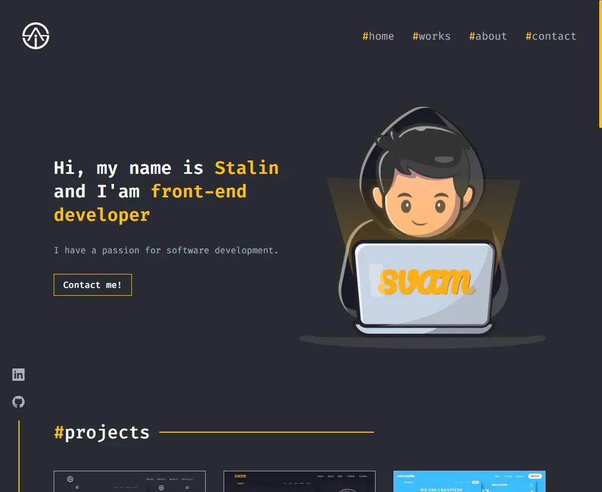

# Portfolio

This is my personal portfolio

## Table of contents

- [Portfolio](#portfolio)
  - [Table of contents](#table-of-contents)
  - [Overview](#overview)
    - [Links](#links)
  - [My process](#my-process)
    - [Built with](#built-with)
  - [Author](#author)

## Overview

### Links

- Live Site URL: [GitHub](https://svam.netlify.app/)

## My process

### Built with

- [Vitejs](https://vitejs.dev/)
- [React.js](https://reactjs.org/)
- [Styled-components](https://styled-components.com/docs/basics)
- [React Router Dom](https://reactrouter.com/en/main)
- [EmailJS](https://www.emailjs.com/)

## Author

- GitHub - [StalinAM](https://github.com/StalinAM)
